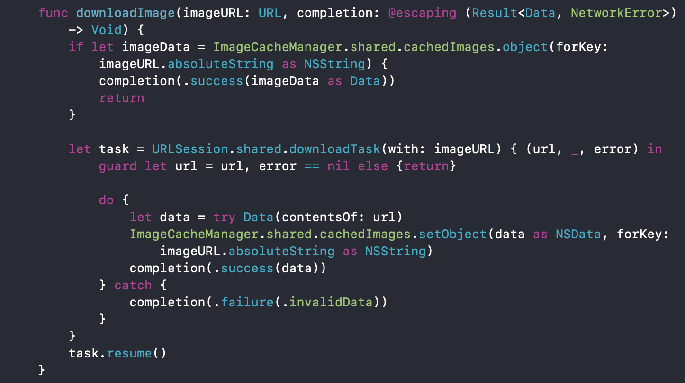

# Unsplash

## 사진 & 사진 정보 보기

   

 

## 사진 검색 

 

 

## 이미지 상세보기

 

 

### Network

#### Generic을 사용함으로써 코드의 재사용성을 높였습니다.

 

#### 이미지 캐싱을 통해 앱의 사용성을 높이고 네트워크 비용을 감소시켰습니다.

 
 

### Memory Management

#### 지연 저장 프로퍼티를 적절히 사용함으로써 불필요한 메모리 사용을 줄였습니다. 

 

#### 미소유 참조를 적절히 사용함으로써 강한 순환 참조로 인한 메모리 누수를 방지했습니다. 

 
 

### Gesture

PhotoDetailViewController는 스와이프를 통한 사진 넘기기, 핀치 제스처를 통한 사진 확대, 펜 제스처를 통한 controller dismiss 등 다양한 제스처를 구분하고 적절히 대응해야 했습니다.

사용자 제스처의 x, y 방향 translation 속도와 이미지의 줌 상태, 그리고 컬렉션 뷰의 x축 기준 contentOffset 값 등 서로 인과관계가 있을 수 있는 속성들을 적절히 이용함으로써 사용자의 다양한 제스처를 구분하고 그에 맞는 기능을 제공할 수 있게 했습니다.

 
 

### CollectionView

#### 사용성 개선

unsplash api는 사진의 주요 컬러 hex 값을 제공해 줍니다.
이 색상 값을 이미지 뷰의 백그라운드 컬러로 사용함으로써 사용자가 이미지가 아직 로드되지 않았음을 인지할 수 있도록 했습니다.

 

#### 셀을 재사용함으로써 생기는 여러 가지 문제들 해결

UICollectionView에서 DequeReusableCell을 사용할 경우 셀을 재활용하기 때문에 생기는 다양한 문제점들이 있습니다.

가장 흔하게 접할 수 있는 문제인 기존에 설정했던 이미지나 배경을 다시 마주하게 되는 경우를 제외하고도, 비동기로 이루어지는 이미지 다운로드 과정이 셀이 재활용된다는 점과 맞물려 원하지 않는 위치에 이미지가 뜰 수 있다는 점을 생각했습니다.

(만약 사용자가 빠르게 아래 방향으로 스크롤 했을 때, 이미지 다운로드가 완료된 후 이미지 뷰에 이미지가 로드 되는 시점이 셀이 두세 번 재활용된 후라면 이미지는 기존에 떠야 할 위치보다 더 아래에 뜨게 됩니다.
이후 셀의 이미지 뷰에는 가장 최근 네트워크 콜백 된 이미지로 바뀌기 때문에 기존 설정된 이미지가 뒤바뀌는 현상이 발생하게 됩니다. 이런 현상은 사용자 경험에 매우 부정적이라고 생각합니다.)

이런 문제를 해결하기 위해 Unsplash API가 제공해 주는 사진 아이디를 이용해서 이미지 다운로드가 완료되어 이미지뷰에 로드되는 시점과 셀 이 실제로 이미지를 보여주는 시점의 id가 일치하는지 유무를 판단함으로써
사용자의 부정적인 사용 경험을 방지하고 불필요한 컴퓨팅 연산은 생략할 수 있도록 설계했습니다.

 

## Requirements
iOS 10+

#### 이미지 제공: https://unsplash.com/developers
